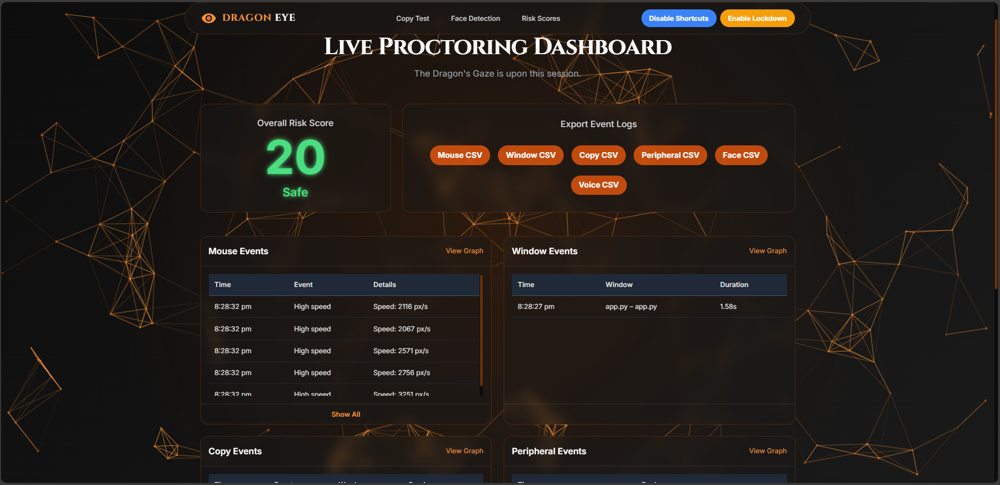
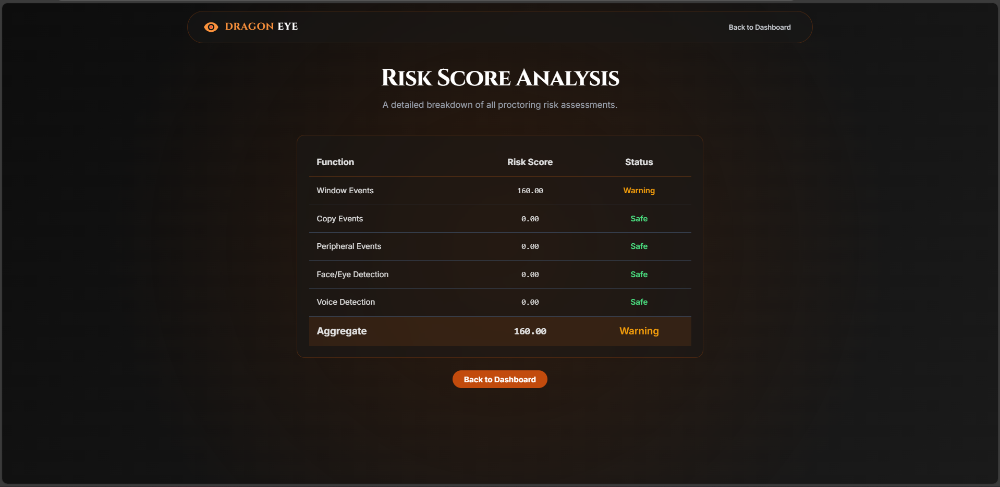
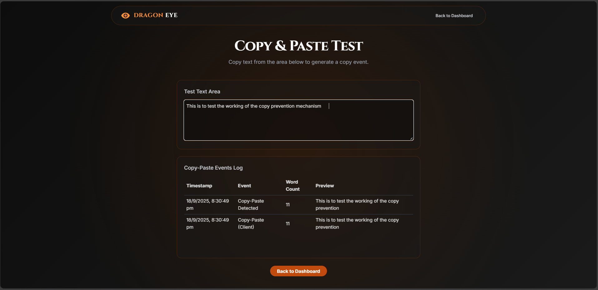

# 🐉 Dragon Proctor – AI-Powered Online Exam Proctoring System

> **Dragon Proctor** is a next-generation online exam proctoring solution that uses **AI**, **computer vision**, and **behavior tracking** to ensure academic integrity during remote examinations.

It combines **face and emotion detection**, **audio analysis**, **behavioral monitoring**, and **network lockdown** to detect suspicious activities in real time. Designed for scalability and transparency, it is perfect for educational institutions and online learning platforms.

---

## 🌟 Features

| Category               | Key Features                                                                                      |
|------------------------|---------------------------------------------------------------------------------------------------|
| **🎥 Camera Monitoring** | - Face detection & identity tracking <br> - Multiple faces detection <br> - Eye gaze detection to check if candidates are looking away |
| **😊 Emotion Recognition** | - Real-time emotion detection (fear, anxiety, stress, etc.) <br> - Helps identify unusual behavior during the exam |
| **🎙 Voice Detection** | - Detects voices other than the candidate <br> - Flags background conversations or verbal cheating |
| **🖱 Behavioral Tracking** | - Mouse activity tracking <br> - Detects copy/paste actions <br> - Window/app switching detection <br> - Detects external devices being connected |
| **🌐 Network Lockdown** | - Blocks unauthorized websites and applications during exams <br> - Prevents access to online resources |
| **⚠ Suspicious Activity Scoring** | - Aggregates multiple signals to calculate a **risk score** <br> - Proctors are alerted when a threshold is crossed |
| **📊 Reports & Logs** | - Detailed logs with timestamps for post-exam analysis <br> - Exportable for auditing and compliance |
| **☁ Scalable Deployment** | - Dockerized setup for easy deployment <br> - Compatible with AWS or Kubernetes for scaling |

---

## 📂 Project Structure

```

dragon\_proctor/
├── app.py                  # Flask backend application
├── face\_detector.py        # Face and eye detection
├── emotion\_model/          # Pre-trained emotion recognition models
│   └── emotion\_detect.keras
├── voice\_detector.py       # Voice activity detection
├── behavior/
│   ├── mouse\_tracker.py    # Mouse movement tracker
│   ├── window\_tracker.py   # Window/app switch detection
│   ├── copy\_tracker.py     # Clipboard monitoring
│   └── peripheral\_detector.py # External device monitoring
├── network/
│   └── network\_lockdown.py # Network access restriction
├── templates/              # HTML templates for dashboard/UI
├── static/                 # CSS/JS files for frontend
├── requirements.txt        # Python dependencies
└── README.md               # Project documentation

````

---

## 🛠 Tech Stack

- **Backend:** Python, Flask  
- **Computer Vision:** OpenCV, MTCNN  
- **Deep Learning:** TensorFlow / Keras  
- **Audio Processing:** WebRTC VAD or similar libraries  
- **Frontend:** HTML, CSS, JavaScript  
- **Deployment:** Docker, GitHub Actions CI/CD  
- **Monitoring & Logging:** Prometheus, Grafana, Fluentd (optional)

---

## 🚀 Getting Started

Follow these steps to set up the project locally:

### 1️⃣ Clone the Repository
```bash
git clone https://github.com/Monish21072004/dragon_proctor.git
cd dragon_proctor
````

### 2️⃣ Create Virtual Environment

```bash
python -m venv venv
source venv/bin/activate  # On Windows: venv\Scripts\activate
```

### 3️⃣ Install Dependencies

```bash
pip install -r requirements.txt
```

### 4️⃣ Run the Application

```bash
python app.py
```

The application will start at: **[http://127.0.0.1:5000/](http://127.0.0.1:5000/)**

---

## 🐳 Docker Deployment

You can also run Dragon Proctor inside a Docker container:

```bash
docker build -t dragon_proctor .
docker run -p 5000:5000 dragon_proctor
```

---

## 📈 Workflow with CI/CD

This repository includes a **GitHub Actions workflow** for automated testing and deployment.

* Lint and test code automatically on every push
* Build and publish Docker images to container registries
* Deploy seamlessly to AWS EC2 or Kubernetes

Workflow file is located at:

```
.github/workflows/ci-cd.yml
```

---

## ⚠️ Important Notes

* **User Privacy:** Always obtain consent from candidates before recording video/audio.
* **Permissions:** Certain features like network lockdown may require **admin/root access**.
* **False Positives:** Unusual but innocent behaviors (e.g., nervousness) can trigger alerts — use the system alongside human review.
* **Hardware Variability:** Performance depends on webcam quality, lighting, and microphone clarity.

---

## 🔮 Future Enhancements

* Live dashboard for proctors with real-time activity visualization
* Browser extension to monitor on-screen activity
* Mobile support for candidates using tablets or phones
* AI-driven adaptive risk scoring
* Localization for multiple languages

---

## 🤝 Contributing

We welcome contributions!
Follow these steps to contribute:

1. **Fork** the repository
2. Create a **feature branch** (`git checkout -b feature/my-feature`)
3. Commit your changes (`git commit -m 'Add new feature'`)
4. Push to your fork (`git push origin feature/my-feature`)
5. Open a **Pull Request**

---

## 📜 License

This project is licensed under the **MIT License**.
See the [LICENSE](LICENSE) file for more details.

---

## 📧 Contact

For questions, feedback, or feature requests:

* **Author:** Monish
* **GitHub:** [Monish21072004](https://github.com/Monish21072004)
* **Project Repo:** [Dragon Proctor](https://github.com/Monish21072004/dragon_proctor)

---

## 🌐 Screenshots / Demo

> *Add screenshots or GIFs here to demonstrate the application.*

| Proctor Dashboard                | Risk Table                       | Copy Paste Test                  |
| -------------------------------- | -------------------------------- | -------------------------------- |
|  |  |  |

---

## ⭐ Show Your Support

If you found this project helpful, please **star the repo** ⭐ to support its growth!

```

---

### **Why This Works Well**
1. **Well-structured** with clear sections (`Features`, `Setup`, `Tech Stack`, etc.).  
2. **Professional tone** suitable for GitHub and resumes.  
3. **Supports visuals** like screenshots or diagrams.  
4. **Easy to read** with tables and markdown formatting.  
5. Ready for **open-source collaboration** with contributing guide and license info.

Would you like me to design **custom badges** (like build status, Docker, Python version) for the top of the README?
```
